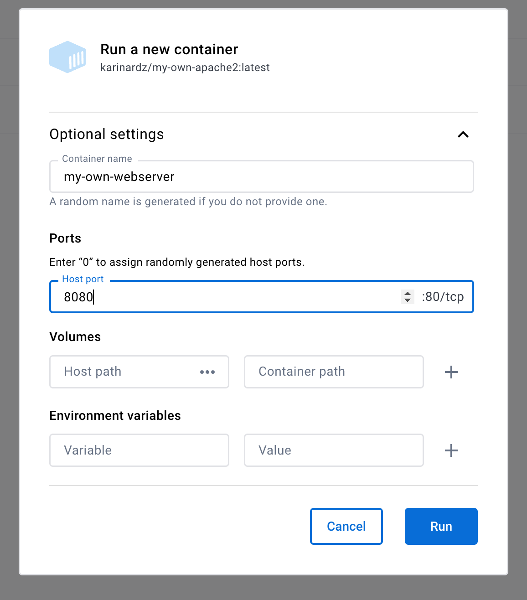

## Create a basic web server image in Docker


For this excercise, we will use Docker.

To start we either search in Docker Hub

{alt='Download my-own-apache2.'}

Or pull a docker image fromt the command line:

```console
foo@bar:~$ docker pull karinardz/my-own-apache2
```

Once you pull the image you should be able to see this in your docker list of images

```console
foo@bar:~$ docker image ls
REPOSITORY                         TAG       IMAGE ID       CREATED          SIZE
karinardz/my-own-apache2           latest    38e2bbc9b07c   46 minutes ago   254MB
```


## Start the web server container

To start the new server

Either start the image in Docker Desktop. 


{alt='Start my-own-apache2.'}

Please note to add your own container name, and add a port to run the webserver,
for example, 8080 as shown in the image.

Or start the container from the command line

```console
foo@bar:~$ docker run -dit --name my-own-webserver -p 8080:80 my-own-apache2
```


Once you pull the image you should be able to see this in your docker list of images

```console
foo@bar:~$ docker container ls
CONTAINER ID   IMAGE                              COMMAND                  CREATED         STATUS         PORTS                    NAMES
ec432b277b4c   karinardz/my-own-apache2           "httpd-foreground"       9 seconds ago   Up 8 seconds   0.0.0.0:8080->80/tcp     my-own-webserver
```


## Run the website on a browser

The container has a basic apache httpd web server installed.

To test this, you can access on a web browser the following address:

http://localhost:8080


Docker Desktop can be used to access the files which are used for the website.
To access this, navigate to: Containers -> my-own-webserver 

You should be able to access the interface with the various tabs:
Logs, Inspect, Terminal, Files, Stats

If you click on 'Files', you will be able to access all the filesystem in your container.
Note this is only in memory, as it is not in your local filesystem.

Using the interface, navigate to: /usr/local/apache2/htdocs


